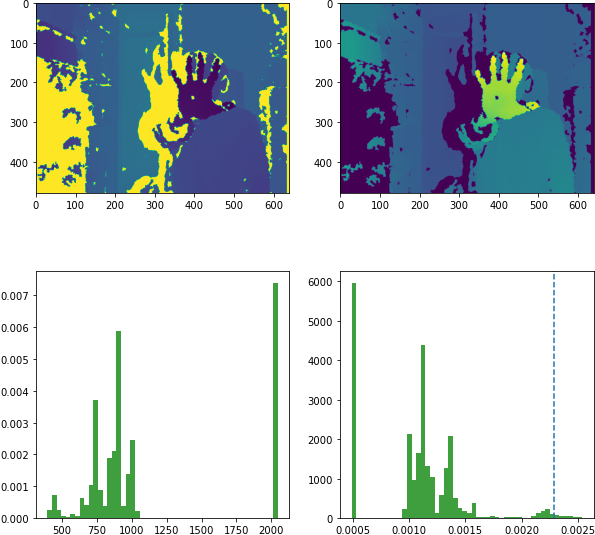

# BUGTIPLY KINECT INTERACTIVE PROGRAM

This code is the base for interacting with the evolutionary game **bugtiply** and can be used as a template for further interactive installations.

## Dependencies.

The script makes use of the [freenect](https://github.com/OpenKinect/libfreenect) kinect drivers and [OpenCV](https://opencv.org/).

## Description.

The script is meant to implement four actions which are used in the game to copy, kill, restart and move the cursor in the game. The script removes the background, isolates the hand connected component and calculates the centroid, area, convex hull and contour to obtain a bounding box, the hand circularity, convexity and box aspect ratio  which can be used to implement a set of commands. The normalised  centroid coordinates and the command are then witten to a `fifo` pipe which is read by the game.

### Background removal.

The script reads frame by frame the depth map from the sensor into a numpy array which is then transform by taking the reciprocal and filtered by a applying a threshold to keep only the values closest to the sensor (Fig. 1)

<figcaption align = "center"><b>Fig.1 - Depth map transformation and backgound  removal thresholding</b></figcaption>

### Coordinates

### Circularity, Convexity and Aspect Ratio.

### Script in action.
